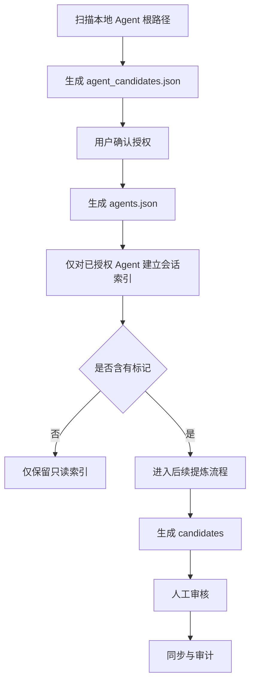

# 多 Agent 协作信息治理与展示方案对齐提案

> updated_at: 2026-06-18  
> status: working-draft  
> targets: `ai-trace-open` & `~/.ai-trace`

## 1. 当前提案目标

当前阶段先不定义完整对象体系，而是先锁定真实流程主轴：

`Scan -> Register -> Index -> Mark -> Extract -> Review -> Sync -> Audit`

公开仓只负责：

- 定义流程契约与字段草案
- 提供后端 CLI 骨架
- 提供 H5 展示与占位入口

私有区负责：

- 保存真实 Agent 运行根路径
- 保存真实会话与索引
- 保存候选提炼结果
- 保存同步队列与审计记录

## 2. 当前目录口径

### 2.1 公开仓 `ai-trace-open`

当前只承认以下 6 个根目录：

1. `docs/`
2. `drafts/`
3. `discussions/`
4. `templates/`
5. `apps/cli/`
6. `apps/dashboard/`

说明：

- `docs/` 放战略与路线图
- `drafts/` 放对齐提案与 SPEC 草案
- `discussions/` 放讨论留痕与共识
- `templates/` 当前保持极简，只保留后续 Promote 的落点
- `apps/cli/` 放 CLI、索引、ETL、同步骨架
- `apps/dashboard/` 放 H5 展示层

任何旧目录口径，如 `runtime/`、`work/`、`governance/`、`profile/`，当前都不再作为公开仓物理落点。

### 2.2 私有区 `~/.ai-trace`

当前最小建议目录：

- `registry/`
- `sessions/`
- `candidates/`
- `sync/queue/`
- `audit/`

更远阶段的对象域目录，待进入相邻阶段后再细化。

## 3. 前端页面树与阶段边界

H5 保留 6 个一级菜单的长期方向：

- `Home`
- `Wiki`
- `Profile`
- `Flow`
- `Agents`
- `Skills`

但当前阶段只点亮：

- `Home`
- `Agents`

其余模块在没有真实数据源前，应明确显示为：

- `Placeholder`
- `Under Construction`
- `Phase 3+`

避免用户和 Agent 把尚未进入实现阶段的页面误判为可用模块。

## 4. 当前流程提案

### Step 1: Scan

- 扫描本地常见 Agent 根路径
- 识别是否存在可用会话源或工作区特征
- 判断单空间 / 多空间模式
- 输出 `agent_candidates.json`

### Step 2: Register

- 用户确认候选 Agent 是否接入
- 输出 `agents.json`
- 绑定 Agent 卡片和私有路径映射

### Step 3: Index

- 仅对已授权 Agent 建立最小会话索引
- 当前只提取最小元数据：
  - `agent_id`
  - `session_id`
  - `updated_at`
  - `cwd`
  - `folder_path`
  - `bookmark_state`

### Step 4: Mark

- 第一版只允许简单显式标记
- 不引入复杂语义筛选
- 标记来源可为：
  - 对话内显式标签
  - H5 列表人工勾选

### Step 5+: Extract / Review / Sync / Audit

这些阶段保留为后续方向，但当前不锁定完整对象模板和最终写回结构。

## 5. 当前需要补的 SPEC

近期必须补的只有：

- `Agent Card`
- `Agent Discovery Rule`
- `Workspace Mode Rule`
- `Session Index`
- `Bookmark Rule`

当前不提前补：

- `Project / Knowledge / Preference / Governance` 的最终模板
- `Skill` 的正式发布格式
- 全自动化同步与归并细节

## 6. 当前建议

对齐优先级如下：

1. 先跑通 `Scan -> Register`
2. 再锁定 `Index -> Mark`
3. 然后再决定什么时候进入 `Extract -> Review -> Sync -> Audit`

这份提案的作用，是保证近期开发围绕真实流程推进，而不是围绕超前对象模板推进。
