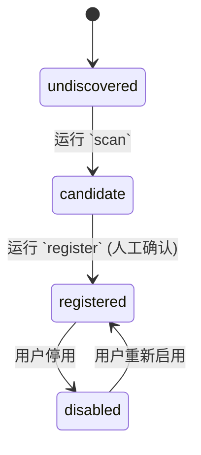

# Scan & Register Flow (扫描与注册流程)

> status: active
> updated_at: 2026-06-24
> layer: flows

本文件定义系统从**扫描发现 (Scan)**到**固化注册 (Register)**的状态机与操作时序。

---

## 1. 核心状态机 (State Machine)

Agent 实体在系统中只允许处于以下几种状态之一：

1. **`undiscovered`** (隐含状态)：存在于磁盘，但系统未扫描到。
2. **`candidate`**：已被 Scan 扫出，等待确认。
3. **`registered`**：已被人工确认，并持久化为正式 Agent Card。
4. **`disabled`**：已被注册，但后来被手动停用（暂停追踪）。

---

## 2. 操作时序流转

### 步骤 1: 扫描探测 (Scan Phase)
1. 发起动作：H5 点击 "Scan" / 终端执行 `python3 apps/cli/main.py scan`。
2. 动作约束：系统读取 [scan_rules.md](../contracts/cli/scan_rules.md) 与 [scan_config.json](../contracts/cli/scan_config.json)，遍历默认路径。
3. 输出结果：在 `~/.ai-trace/data/registry/agent_candidates.json` 中落盘 `candidate` 对象数组。若开启 `--mock` 则写入公开仓。
4. 状态转移：生成具有 `candidate-<id>` 的对象。

### 步骤 2: 确认注册 (Register Phase)
1. 发起动作：H5 点击 "Register" 提交表单 / 终端执行 `python3 apps/cli/main.py register --candidate-id ...`。
2. 动作约束：
   - 校验指定的 `candidate_id` 必须存在且状态为 `candidate`。
   - 用户可提供自定义 `alias`。
   - 用户确认选择默认工作区（如果为 multi-space）。
3. 输出结果：
   - 写入单体 `~/.ai-trace/data/agents/<agent_id>.json`。
   - 更新汇总表 `~/.ai-trace/data/registry/registered_agents.json`。
4. 状态转移：产生状态为 `registered` 的 Agent Card 对象。
